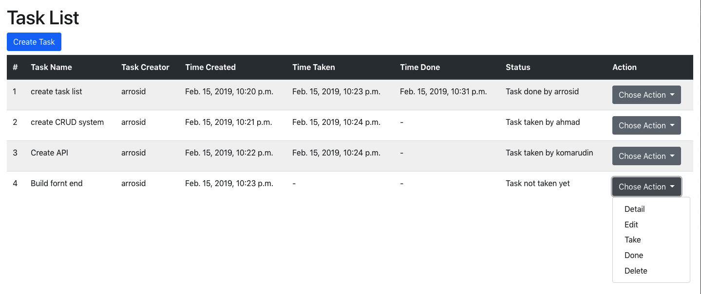

# Simple Project Dashboard build in Django 2.1
This is Simple Project Dashboard application build using django that I have created for less than 24 hours. 

If you interest to run this project, you can follow this instructions
<ol>
    <li>Clone this repository</li>
    <ul>
        <li>git clone git@github.com:arrosid/simple-project-dashboard-django.git</li>
        <li>cd simple-project-dashboard-django</li>
    </ul>    
    <li>Create virtual environtment and install requirements python modules</li>
    <ul>
        <li>virtualenv -p python3 env</li>
        <li>source env/bin/activate</li>
        <li>pip install -r requirements.txt</li>
    </ul>
    <li>Create django user & run the project</li>
    <ul>
        <li>python manage.py createsuperuser</li>
        <li>python manage.py runserver</li>
    </ul>
    <li>Now your Simple Project Dashboard application is ready to use! navigate to localhost:8000/task_list</li>
</ol>